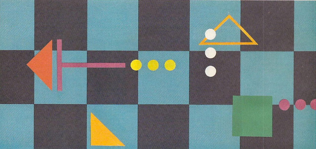
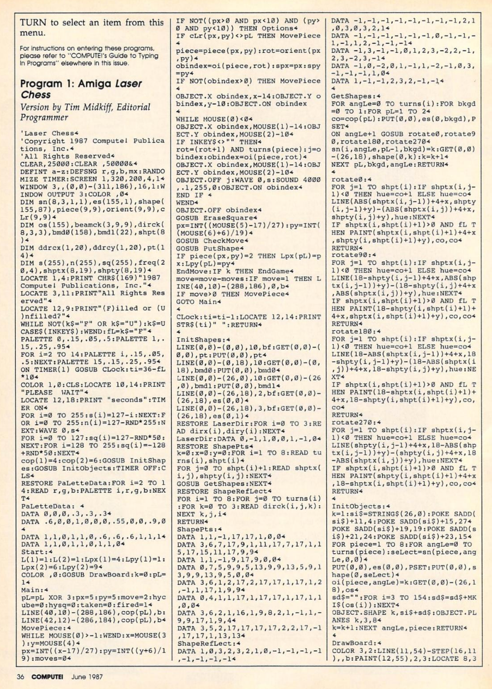
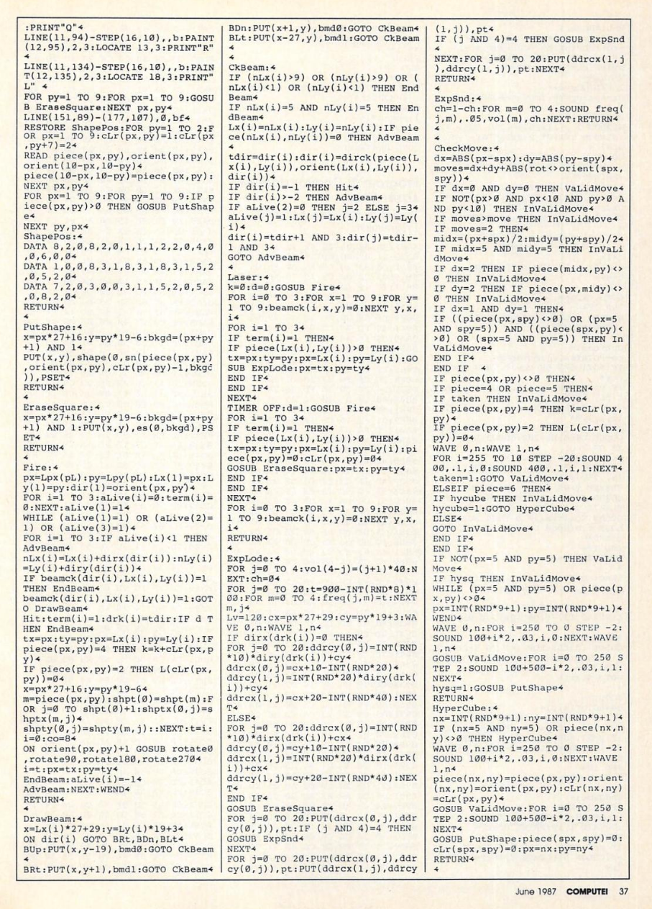
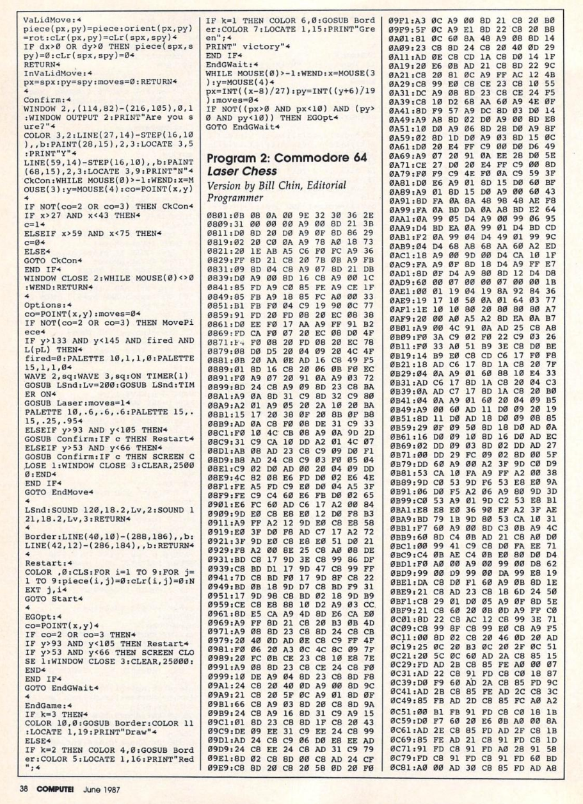

Laser Chess
===


The [1987 Compute! magazine](https://archive.org/stream/1987-06-compute-magazine/Compute_Issue_085_1987_Jun#page/n25/mode/1up) game,
["Laser Chess"](https://en.wikipedia.org/wiki/Laser_Chess) by Mike Duppong,
was one of the larger programs that I typed in.  

The [Amiga BASIC source version](https://archive.org/stream/1987-06-compute-magazine/Compute_Issue_085_1987_Jun#page/n37) was by Tim Midkiff and is the basis for this port to p5js.

It is playable in browser with https://rawgit.com/osresearch/laserchess/master/index.html"

Source code
===






Notes
===

* For local development, serve this directory with python and go to http://localhost:8000/
```
python -mSimpleHTTPServer 8000
```

* [Amiga Basic reference](http://www.pjhutchison.org/emulation/uae_amigabasic.html)
* [P5 Reference](https://p5js.org/reference/)


TODO
===

* rotate commands
* sprite redraw
* end game
* sound
* scaling
* laser out of bounds

